# Snack Stack

## Table of Contents
- [Snack Stack](#snack-stack)
  - [Table of Contents](#table-of-contents)
  - [Overview](#overview)
    - [Problem](#problem)
    - [Approach](#approach)
    - [Use Case Ideas](#use-case-ideas)
    - [Beyond the Basics](#beyond-the-basics)
  - [Deployment](#deployment)
  - [Continuous Integration](#continuous-integration)
  - [Team Contract](#team-contract)
  - [User Guide](#user-guide)
    - [Sign in page](#sign-in-page)
    - [Dashboard](#dashboard)
    - [View your pantry](#view-your-pantry)
    - [Add and Edit your pantry](#add-and-edit-your-pantry)
    - [Create Shopping Lists](#create-shopping-lists)
    - [Find Recipes](#find-recipes)
  - [User Stories](#user-story)
  - [Developer Guide](#developer-guide)
    - [Installation](#installation)
    - [Application Design](#application-design)
  - [Milestones](#milestones)
  - [Development Team](#development-team)
  - [Team Contract](#team-contract-1)

<!--
comment out add in later as we progress through project
* [User Guide](#user-guide)
* [Community Feedback](#community-feedback)
* [Developer Guide](#developer-guide)
* [Development History](#development-history)
* [Continuous Integration](#continuous-integration)
* [Walkthrough videos](#walkthrough-videos)
* [Example enhancements](#example-enhancements)
* [Team](#team)
-->

---

## Overview

### Problem
_What's the point of a Snack Stack?_
- People often forget what they have in their pantry, fridge, or spice rack
- Expired food leads to waste and wasted money 
- Grocery shopping is inefficient without knowing what's already at home

### Approach
- Create a digital inventory system for pantry, fridge, freezer, and spices
- Allow users to easily add, remove, and update items
- Automatically generate shopping lists when items are low or missing
- Simple and clean interface so it's quick to use every day

### Use Case Ideas
- Before going to the store, check what items are low or expired
- While cooking, search the app to see if you have a specific ingredient
- Share the pantry list with family or roomates so everyone is synced
- Use expiration reminders to finish food before it spoils

### Beyond the Basics
- Barcode scanner for quick item entry
- Recipe suggestions based on available ingredients 
- Reports that show spending trends and reduce food waste
- Possible integration with smart home assistance like Alexa or Google Assistant

## Deployment
Snack Stack is deployed through Vercel, taking advantage of its seamless integration with GitHub and strong support for Next.js applications. The repository’s main branch is connected directly to Vercel, which means that any changes merged into main automatically trigger a new production build. This continuous deployment pipeline ensures that the application is always up to date with the latest code.

During each deployment, Vercel installs the project dependencies, generates the Prisma client, applies any pending database migrations, and then builds the Next.js application for production. Once the build process completes, Vercel publishes the new version of the site, replacing the old one with zero downtime. This automated flow allows the team to focus on development while keeping deployment consistent and reliable.

The live site can be accessed here: [Snack Stack](https://snack-stack-uhm.vercel.app/)

---

## Continuous Integration
[](https://github.com/snack-stack-uhm/snack-stack/actions/workflows/ci.yml)


---

## Team Contract
[Link to Team Contract](https://docs.google.com/document/d/1agUDEXML0mpS8pNNdEmx55DyYQOOBeRJWTL9lC9QDy4/edit?usp=sharing)

<!-- PDF.js settings -->
<div id="pdf-viewer" style="
    max-width:900px;
    margin:20px auto;
    border:1px solid #ccc;
    border-radius:8px;
    box-shadow:0 4px 10px rgba(0,0,0,0.1);
    overflow-y:auto;
    height:800px;
    background-color:white;
    padding:10px;
"></div>

<script src="https://cdnjs.cloudflare.com/ajax/libs/pdf.js/3.11.174/pdf.min.js"></script>
<script>
const url = '/assets/team-contract.pdf';
const container = document.getElementById('pdf-viewer');

pdfjsLib.getDocument(url).promise.then(pdf => {
  for (let i = 1; i <= pdf.numPages; i++) {
    pdf.getPage(i).then(page => {
      const scale = 1.5;
      const viewport = page.getViewport({ scale });
      const canvas = document.createElement('canvas');
      const ctx = canvas.getContext('2d');
      canvas.height = viewport.height;
      canvas.width = viewport.width;
      canvas.style.display = 'block';
      canvas.style.margin = '10px auto';
      container.appendChild(canvas);
      page.render({ canvasContext: ctx, viewport: viewport });
    });
  }
});
</script>

---

## User Guide
An intro to using Snack Stack  

### Sign in page
Sign up for Snack Stack and verify your email to sign in
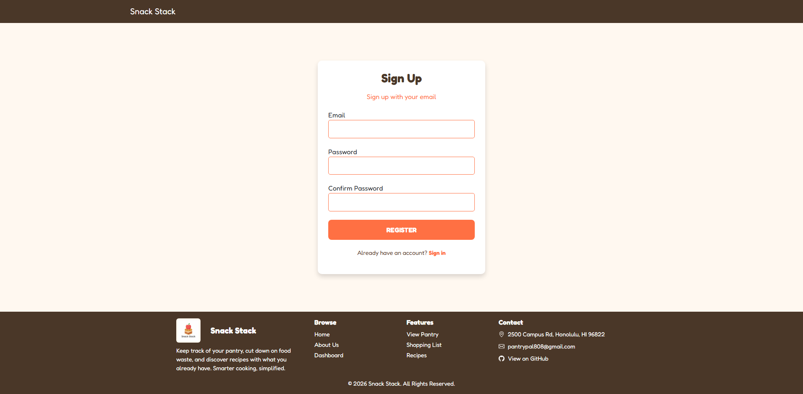
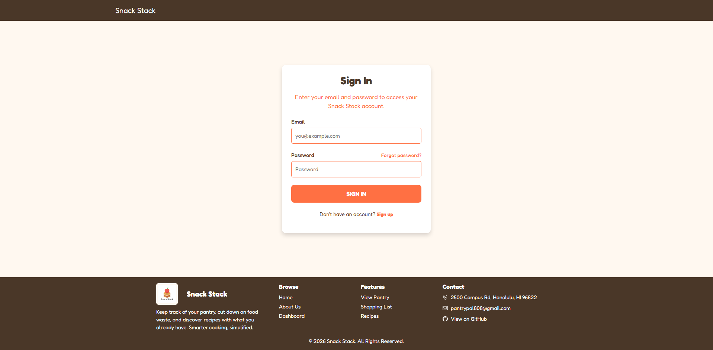

### Dashboard
Users have easy access to all pages through Snack Stack's dashboard
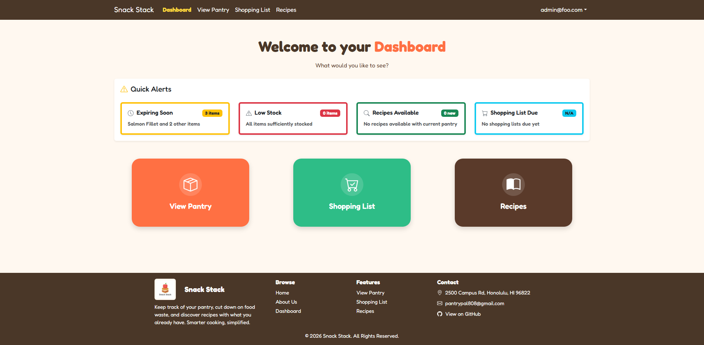

### View your pantry
Snack Stack allows you to easily keep track of what ingredients you have in your household, where they are, and how much of them you have left
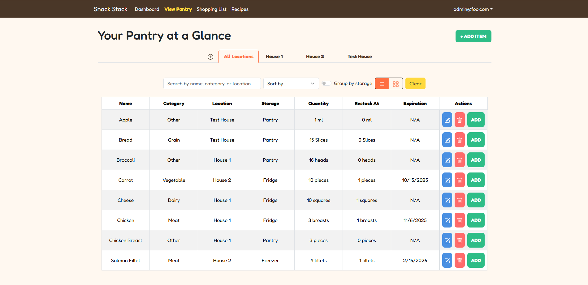

### Add and Edit your pantry
Keep track of your spices and food by adding them to your pantry  
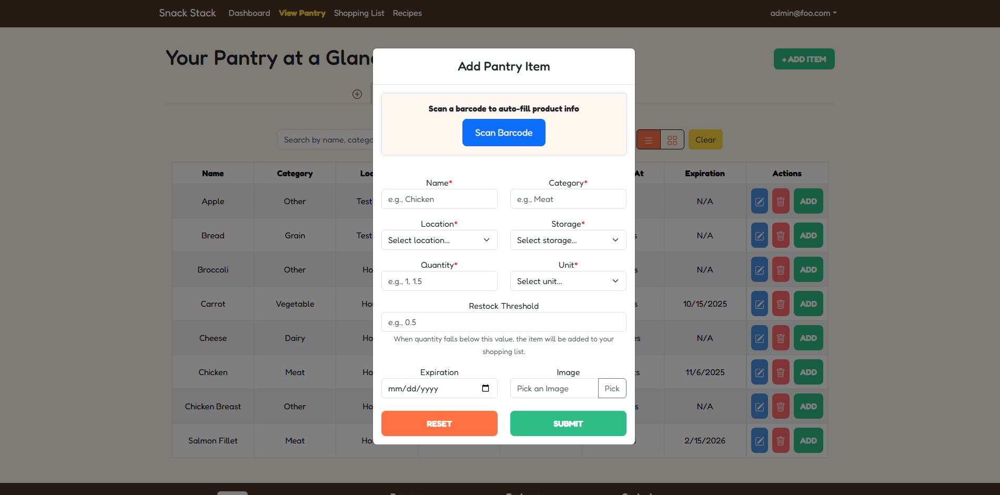
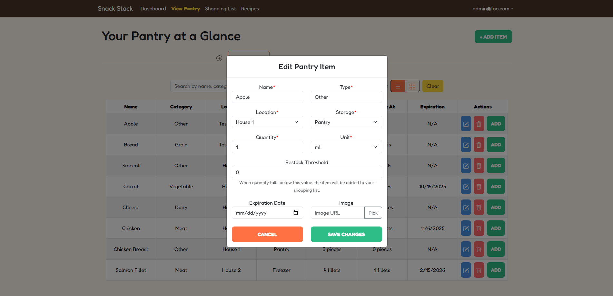
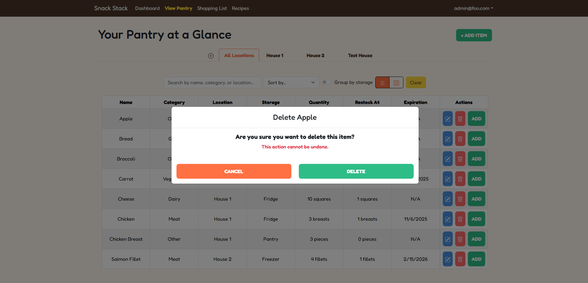

### Create Shopping Lists
Easily create and manage your shopping list based on what’s running low in your pantry. Check off items as you shop to keep your inventory up to date.
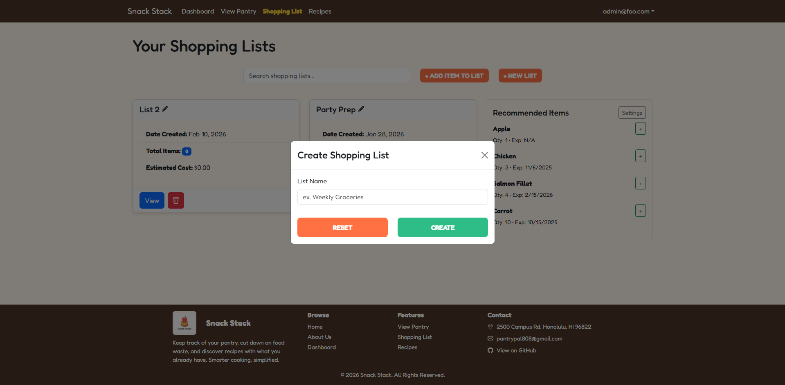
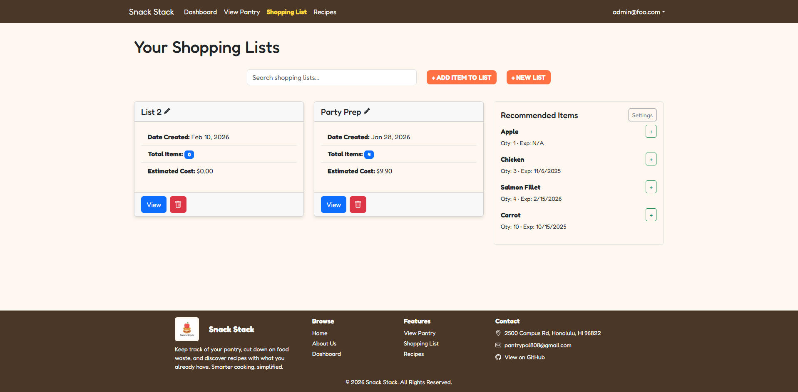
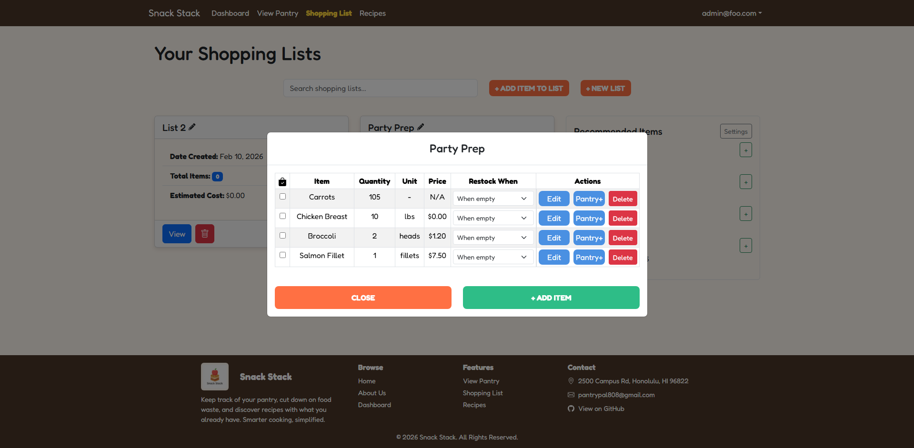

### Find Recipes
Discover recipes you can make with the ingredients you already have. Snack Stack helps you reduce waste and find meal ideas tailored to your pantry.
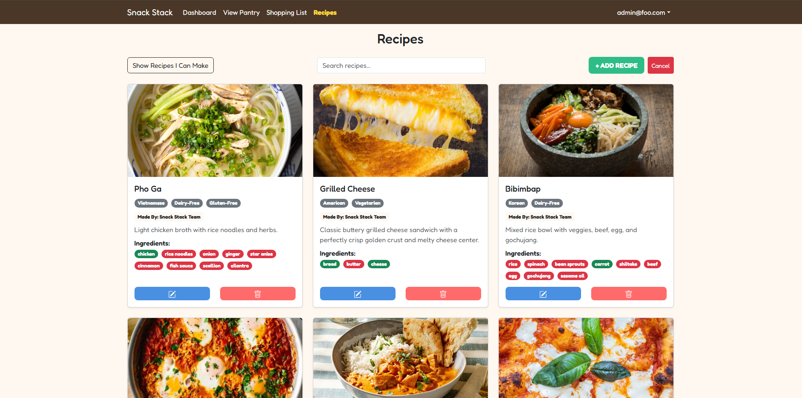

---

## User Story

### User Story #1 - Mobile Friendly

As an active user I really wish this was more accessible from my phone so that I don't need my laptop in the kitchen.

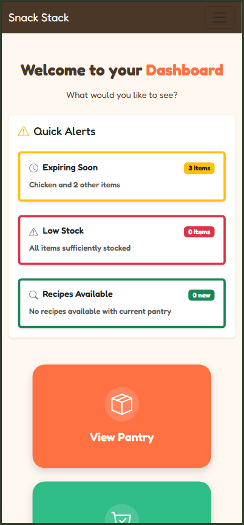
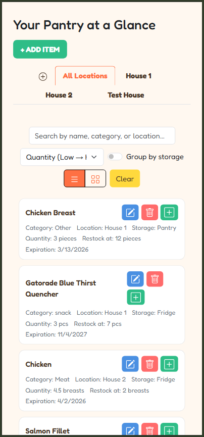
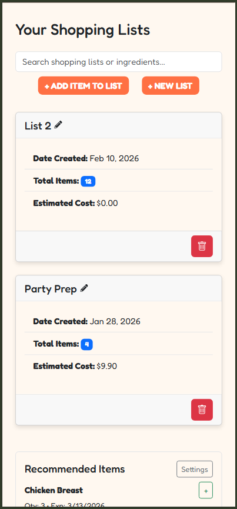

### User Story #2 - Food Item Quantities

As a new user, when adding food to my shopping list and/or pantry the quantity and unit selections is really confusing and seemingly inaccurate, please make it all the same so that it is less confusing.

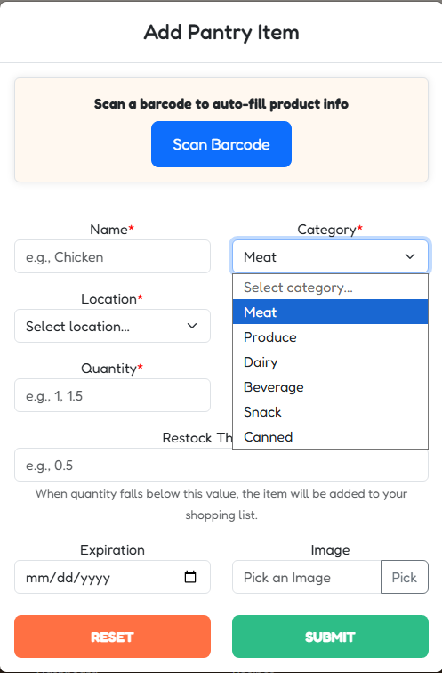
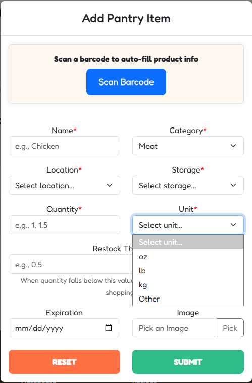
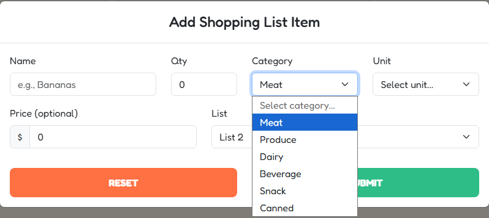

### User Story #3 - Cancel Button

As an indecisive person, when editing my produce in my pantry the reset button does nothing next to the save button, I think it would be nice instead to have a cancel button that undos all changes made and exits so that it has a purpose and helps me.

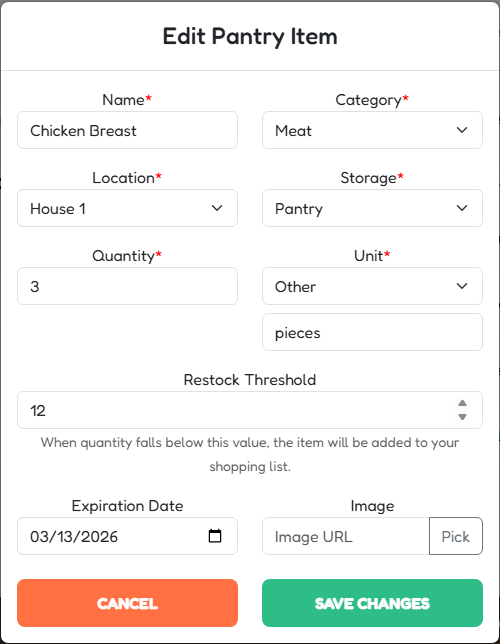

### User Story #4 - Searching Ingredients

As a person with a lot of shopping lists, when I am searching in my shopping lists I can only search for shopping list names, it would be nice to be able to search by ingredient also so I can see if my lists already have an item.

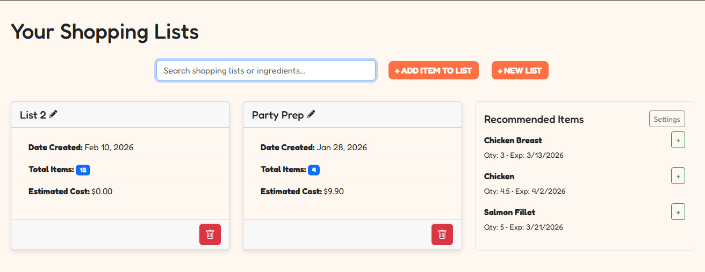
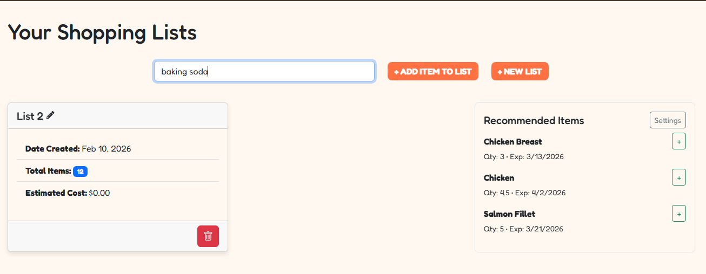

### User Story #5 - Clickable Lists

As a cook, to look at my shopping lists it is kind of inconvenient to have to click on view to see the list it would be faster to be able to click on the recipe itself and view it that way so that when I am busy cooking and multitasking its easier to see on command.

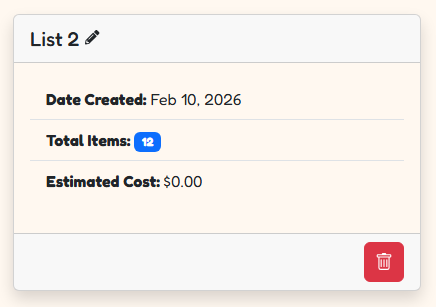
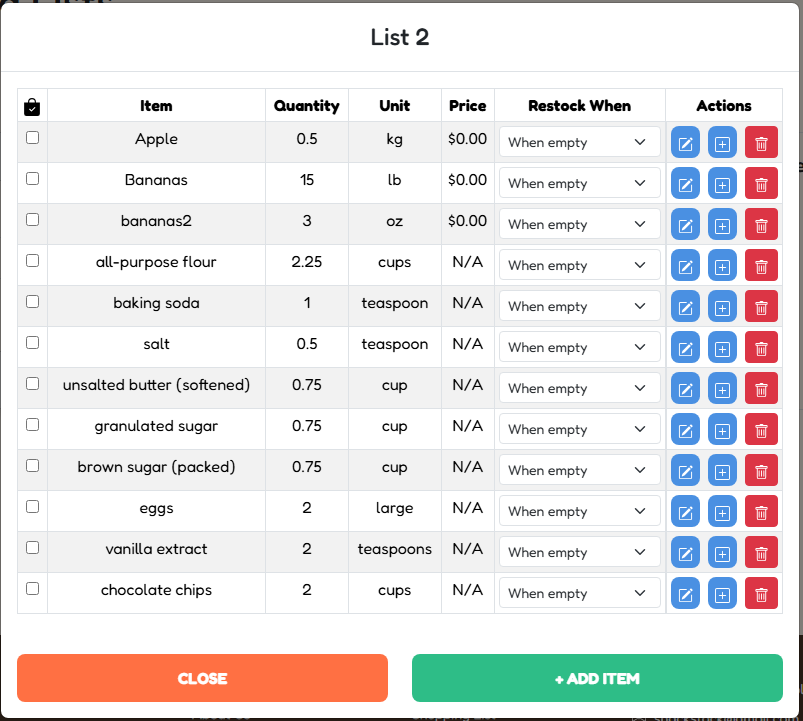

### User Story #6 - Button Icons

As someone with poor eyesight, the buttons on the editing items in shopping list and pantry are very large with the full words "edit" and "delete", I think it would look a lot cleaner/not take up the whole screen, if it was just icons of a pencil and a trash can instead.


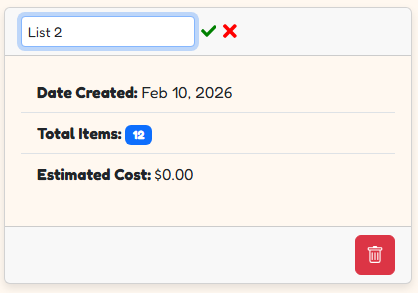


### User Story #7 - Show Recipes I can Make

As a college student, with everything I have in my pantry, is there a way to see what I can make out of the recipes to make figuring out what to make easier?


### User Story #8 - Barcode Scanner 

As a mom, I do not always have the time to always fill in all the information for each pantry item when I add them, I wish I could just scan the item with my camera and add it that way so that I can do it very quickly.

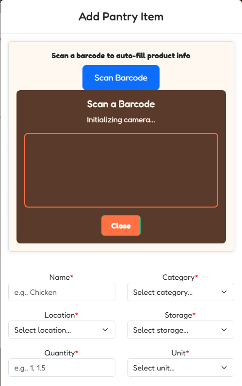
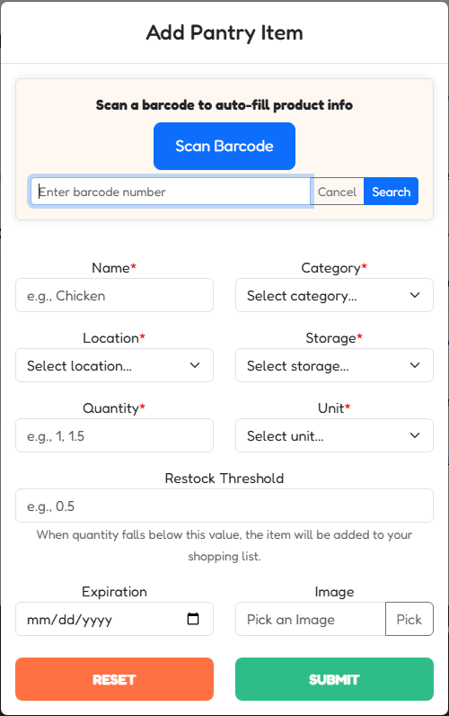

### User Story #9 - Hiding Email

As someone who values my privacy and my information, please remove my email from my recipes posts so that my email is hidden from other users.

## Developer Guide
This section provides information of interest to developers wishing to use this code base as a basis for their own development tasks.

### Installation
First, install [Node.js](https://nodejs.org/en/download/)

Second, visit the [Snack Stack application github page](https://github.com/snack-stack-uhm/snack-stack), and click the “Use this template” button to create your own repository initialized with a copy of this application. Alternatively, you can download the sources as a zip file or make a fork of the repo. However you do it, download a copy of the repo to your local computer.

Third, cd into the pantry-pal directory and install libraries with:
```
$ npm install
```

Fourth, run the system with:
```
$ npm run dev
```

If all goes well, the application will appear at [http://localhost:3000](http://localhost:3000).

### Application Design
Snack Stack is based upon the ICS Software Engineering [Next.js Application Template](https://github.com/ics-software-engineering/nextjs-application-template).

---

## Milestones

### Milestone 1 Progress
[Milestone 1 Project Board](https://github.com/orgs/snack-stack-uhm/projects/1)

### Milestone 2 Progress
[Milestone 2 Project Board](https://github.com/orgs/snack-stack-uhm/projects/4)


### Milestone 3 Progress
[Milestone 3 Project Board](https://github.com/orgs/snack-stack-uhm/projects/6)

### Milestone 4 Progress
[Milestone 4 Project Board](https://github.com/orgs/snack-stack-uhm/projects/7)

### Milestone 5 Progress
[Milestone 5 Project Board](https://github.com/orgs/snack-stack-uhm/projects/10)

### Milestone 6 Progress
[Milestone 6 Project Board](https://github.com/orgs/snack-stack-uhm/projects/11)

## Development Team
[Justin Eugene Natividad](https://github.com/jenativi)  
[Cassandra Huber](https://github.com/cassandrahuber)  
[Darin Wong](https://github.com/darinw7)  
[Justin Sumiye](https://github.com/jsumiye)  
[Min Jun Han](https://github.com/min-808)  

## Team Contract
[Link to Team Contract](https://docs.google.com/document/d/1agUDEXML0mpS8pNNdEmx55DyYQOOBeRJWTL9lC9QDy4/edit?usp=sharing)
